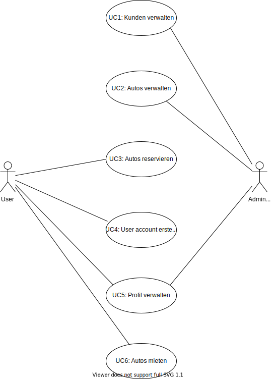

Use Case
---------------------

## Description
### UC1: Kunden verwalten
Der Sachbearbeiter (Admin user) kann Kunden mit Namen und Adresse und Kundennummer im System verwalten, d.h. erfassen, bearbeiten, löschen und den Kunden mit dessen Namen oder Kundennummer suchen.
### UC2: Autos verwalten
Der Sachbearbeiter kann zudem die Autos von CarRent verwalten und nach denen suchen.
Jedes Auto kann einer bestimmten Klasse zwischen Luxusklasse, Mittelklasse oder Einfachklasse zugeordnet werden und besitzt zudem eine Marke, einen Typ und eine eindeutige Identifikation.
### UC3: Autos reservieren
Bei einer neuen Reservation kann der Kunde ein Auto aus einer bestimmten Klasse wählen. Er muss zudem die Anzahl der Tage angeben, die er das Auto gerne mieten möchte. Dabei werden die Gesamtkosten berechnet. Wird die Reservation gespeichert, so wird sie mit einer Reservationsnummer ablegt
### UC4 User account erstellen
User können sich einen Useraccount erstellen um anschliessend über den Account Autos zu mieten
### UC5: Profil verwalten
Sowohl Admin User als auch User können ihr Profil editieren und Name und Adresse anpassen.
### UC6: Autos mieten
Bei Abholung des Autos wird die Reservation in einen Mietvertrag umgewandelt.